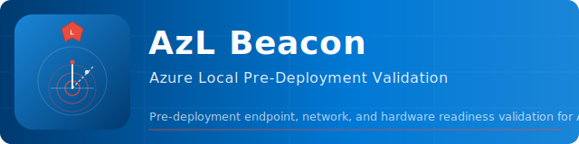

---
hide:
  - navigation
---

# AzL Beacon



**Pre-deployment endpoint and network readiness validation for Azure Local.**

When deploying Azure Local, there are scenarios where no existing systems are present on the management or compute VLANs — no jump host, no domain controller reachable, no way to plug in a laptop and get an IP on the right network. You need to know the network is fully functional *before* the cluster deployment starts, not discover firewall gaps or DNS failures halfway through a six-hour deployment wizard run.

AzL Beacon solves this. It boots directly from an iDRAC virtual media session or USB drive on the bare Dell AX hardware — no installed OS, no domain join, no licensing required — and validates every network dependency Microsoft requires for Azure Local. If Beacon passes, you can deploy with confidence. If it fails, you know exactly what to fix before you've committed any time to the deployment itself.

---

## What it validates

=== "Active Directory"

    - Basic network and NIC status
    - DNS resolution (forward + reverse, TCP/UDP port 53)
    - AD port reachability: LDAP 389/636, Kerberos 88, RPC 135, DNS 53
    - DNS SRV record: `_ldap._tcp.dc._msdcs.<domain>`
    - Azure endpoint sweep (firewall requirements + EastUS HCI endpoints + Dell OEM)
    - Environment Checker: connectivity + network validation

=== "Local Identity (AD-less)"

    - Basic network and NIC status
    - DNS resolution
    - Azure endpoint sweep including Key Vault endpoints
    - Environment Checker: connectivity + network validation
    - No AD checks — nodes use static IP + Azure Key Vault for identity

=== "Networking & Firewall"

    - Basic network (gateway reachability, NIC status)
    - DNS resolution
    - Full endpoint sweep: Azure Local firewall requirements + EastUS HCI endpoints + Dell OEM endpoints
    - Environment Checker: connectivity + network validation

---

## Hardware support — v1.0.0-pre

| Vendor | Adapter | Driver | Version |
|---|---|---|---|
| Broadcom | NetXtreme-E 57400/57500 (bnxt) | `bnxtnd` | 236.1.152.0 |
| Broadcom | NetXtreme 5720 (1GbE LOM) | `b57nd60a` | 221.0.8.0 |
| Intel | E810 800-series | `icea` | 1.17.73.0 |
| Intel | E823 800-series | `scea` | 1.16.58.0 |
| Mellanox/NVIDIA | ConnectX (mlx5/WinOF-2) | `mlx5` | 24.4.26429.0 |

Source: Dell AX 16G SBE bundle `5.0.2603.1641`.

---

## Quick start

```powershell title="Build the ISO (Windows ADK + WinPE add-on required)"
# Clone the repo
git clone https://github.com/AzureLocal/azurelocal-beacon
cd azurelocal-beacon

# Build — Dell AX NIC drivers included; Admin elevation required
.\src\Build-WinPEImage.ps1
```

Boot the resulting `src/output/azl-validate-<date>.iso` via iDRAC virtual media or USB.

!!! tip "Air-gapped build"
    Supply a pre-downloaded PS7 zip and skip the module download:
    ```powershell
    .\src\Build-WinPEImage.ps1 -PS7ZipPath C:\downloads\PowerShell-7.4.6-win-x64.zip -SkipModuleDownload
    ```

---

## Validation lifecycle

| Stage | When | Tool |
|---|---|---|
| **Stage 1 — Pre-OS** | Before OS install, booting from Beacon ISO | AzL Beacon (this tool) |
| Stage 2 — Post-OS | After OS install, before Arc registration | AzStackHci.EnvironmentChecker on each node |
| Stage 3 — Pre-deploy | After Arc registration | Azure portal environment checker |
| Stage 4 — Deployment | During portal wizard | Built-in deployment validation |
| Stage 5 — Post-deploy | After deployment completes | Operational health checks |

---

## Project

- **Organization:** [AzureLocal](https://github.com/AzureLocal)
- **Repository:** [azurelocal-beacon](https://github.com/AzureLocal/azurelocal-beacon)
- **Platform:** [HCS Platform Engineering](https://github.com/AzureLocal/platform)
- **Owner:** Kristopher Turner — kris@hybridsolutions.cloud
